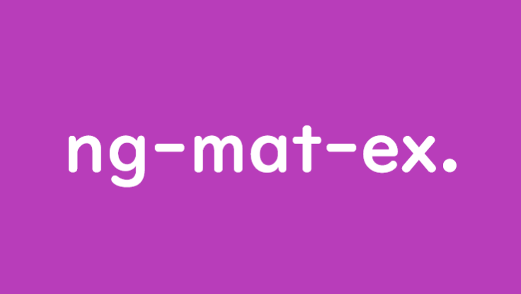

<br>
<h1 align="center">
<b>Angular Material Examples</b>
<br>
<br>

<br>
<br>
</h1>

<br>

<p>
Working examples of Angular Material Design components.
<br>
<br>
I'll provide documentation to hopeful some possible problems you may run into as you integrate and use Angular's Material modules.

However, please ensure you use [material.angular.io](https://material.angular.io/) as your primary source as a guide for understanding and using Material Design components.
</p>

<p align="right">— @pjnalls</p>

<br>

<hr>

<br>

## **Getting Started**

<br>
<br>

### Prerequisites

<br>

* An installation of Node.js (I'm using version `14.15.0`.)
* A global installation of Angular CLI (I'm using version `11.2.8`.)

<br>
<br>

### Steps Before Using Examples

<br>

If you already:
1. have an Angular 11+ app generated with Angular CLI, and
2. have Angular Material added to your app...

... then feel free to skip this section.

<br>

If you want to generate an Angular 11+ app then run the following commands from your local system terminal:


``` bash
$ ng new <new-app-name>
```

<br>

You'll have a few prompts you'll need to provide some input.
Your input should be independent from what is needed for Angular Material examples in this repository.

...

```bash
$ cd ./<new-app-name>

$ ng add @angular/material
...
```

<br>

You'll have a prompt which will ask which Material Design theme you'd like: select any one you'd like.

You'll also have 2 more prompts which you should say "Yes" to both.

...

<br>

Here's what your complete output should look like the terminal after a line after `ng add @angular/material` and the 3 prompts:

```bash
ℹ Using package manager: npm
✔ Found compatible package version: @angular/material@11.2.8.
✔ Package information loaded.
✔ Package successfully installed.
? Choose a prebuilt theme name, or "custom" for a custom theme: Indigo/Pink        [ Preview: https://material.angular.io?theme=indigo-pink ]
? Set up global Angular Material typography styles? Yes 
? Set up browser animations for Angular Material? Yes
UPDATE package.json (1276 bytes)
✔ Packages installed successfully.
UPDATE src/app/app.module.ts (502 bytes)
UPDATE angular.json (3981 bytes)
UPDATE src/index.html (586 bytes)
UPDATE src/styles.scss (181 bytes)
```

<br>

## [**Angular Material Design Component Examples**](https://github.com/pjnalls/ng-material-examples/tree/main/src/app)

<br>
I'll mention it here but also at the header-link (directly above) to my examples:

I'm using the Angular `./src/app` folder as the central place where I'm storing all my working examples.

Please go there or [here](https://github.com/pjnalls/ng-material-examples/tree/main/src/app) for those examples.

<br>
<br>

<hr>

<br>